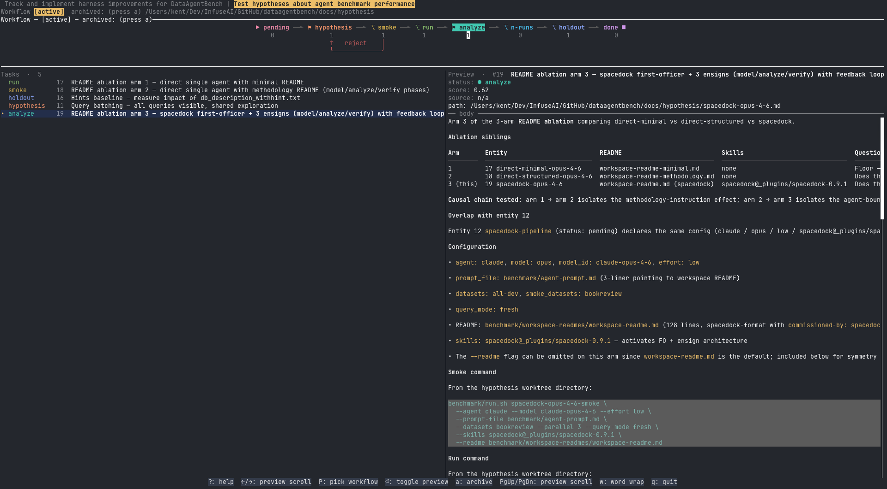

# Spacetop

Spacetop is a Rust terminal UI for browsing [Spacedock](https://github.com/clkao/spacedock) workflow state.



Spacedock stores workflow progress as markdown files in git. A workflow directory typically contains a `README.md` that defines stages and gates, plus entity files with YAML frontmatter such as `id`, `title`, and `status`. Spacetop is intended to make those state files easier to inspect from the terminal.

## Goals

- Discover or open a Spacedock workflow directory.
- Parse workflow metadata and markdown work item frontmatter.
- Browse work items by status, stage, or file.
- Preview the selected item's markdown body and stage reports.
- Surface useful workflow signals such as pending gates, blocked items, stale items, and active work.

## Status

Spacetop is an active read-first TUI. It can discover workflows, open an explicit
workflow directory, parse active and archived work items, preview markdown,
render workflow graphs, show selected worktree state, auto-refresh filesystem
changes, and explicitly sync with `git pull --ff-only`.

The product contract remains read-only by default: Spacedock markdown files are
the source of truth, and state-changing features must be explicit and auditable.

## Expected Stack

- Rust
- Cargo workspace with `spacetop-core` for pure workflow logic and `spacetop`
  for the CLI/TUI binary
- `ratatui` for terminal UI rendering
- `crossterm` for terminal backend and input events
- `serde` and `serde_yaml` for structured metadata parsing
- `notify` for filesystem watching
- `walkdir` for workflow discovery
- `thiserror` and `anyhow` for structured errors at the right boundary

## Prerequisites

Install Rust (which includes the Rust toolchain and Cargo) using `rustup`:

```bash
curl --proto '=https' --tlsv1.2 -sSf https://sh.rustup.rs | sh
```

After installation, verify both tools are available:

```bash
rustc --version
cargo --version
```

## Development

Common local commands:

```bash
cargo fmt
cargo test
make lint
cargo run -p spacetop -- --workflow-dir docs/spacetop-dev
```

Workspace layout:

- `crates/spacetop-core/` contains domain, parser, discovery, watcher, git sync,
  and editor helpers. It has no terminal UI dependencies.
- `crates/spacetop/` contains the CLI, TUI app state, rendering, terminal event
  loop, and release-only Sentry setup.
- `tests/fixtures/` contains shared integration-test fixtures.

Release and versioning policy lives in `docs/release-policy.md`.

### Setup

On a fresh clone, install the required Rust components once:

    make bootstrap

This adds the `clippy` component to the active toolchain. `make lint` and
`make build` will refuse to run until clippy is available and will point you
back at this command.

### Install Released Binary

Download the archive for your platform from the GitHub Releases page:

- macOS Apple Silicon: `spacetop-vX.Y.Z-aarch64-apple-darwin.tar.gz`
- Linux x64: `spacetop-vX.Y.Z-x86_64-unknown-linux-gnu.tar.gz`

Verify the archive against `SHA256SUMS`, then unpack it and move `spacetop` into
a directory on your `PATH`.

Example:

```bash
tar -xzf spacetop-vX.Y.Z-aarch64-apple-darwin.tar.gz
install -m 755 spacetop-vX.Y.Z-aarch64-apple-darwin/spacetop ~/.cargo/bin/spacetop
spacetop --version
```

### Install Local Build

Contributors can still build and install from the current checkout:

```bash
make build
make install
```

By default, install places the binary at `~/.cargo/bin/spacetop`.

To install to a different location, override `PREFIX`:

```bash
make install PREFIX=/usr/local/bin
```

To remove the installed binary:

```bash
make uninstall
```

## Safety

Spacetop should be read-only by default. Future write features should make state changes explicit and easy to audit through git.
