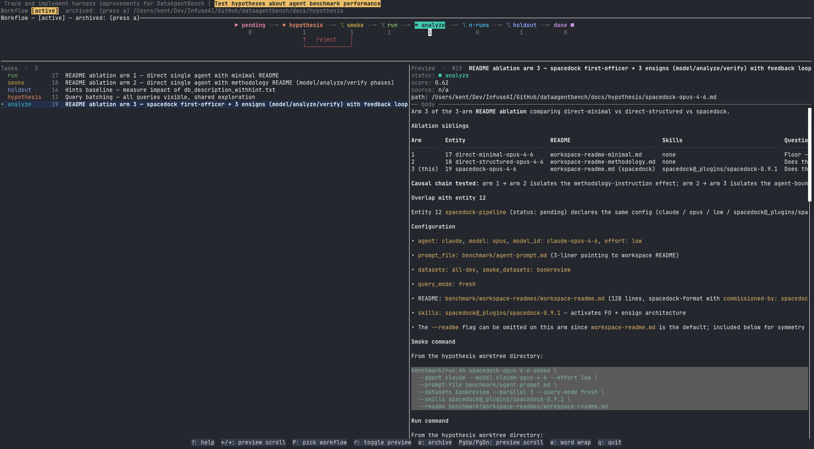

# Spacetop

Spacetop is a Rust terminal UI for browsing [Spacedock](https://github.com/clkao/spacedock) workflow state.



Spacedock stores workflow progress as markdown files in git. A workflow directory typically contains a `README.md` that defines stages and gates, plus entity files with YAML frontmatter such as `id`, `title`, and `status`. Spacetop is intended to make those state files easier to inspect from the terminal.

## Installation

Install the latest released binary with one command:

```bash
curl -fsSL https://github.com/spacedock-dev/spacetop/releases/latest/download/install.sh | sh
```

The installer script is published with each GitHub Release, so later changes on
`main` cannot change this install path accidentally. It installs the latest
released binary, verifies the selected archive against the release `SHA256SUMS`
file, and installs `spacetop` to `~/.cargo/bin` by default. The supported binary
platforms are macOS Apple Silicon and Linux x64.

Override the install directory with an absolute path:

```bash
curl -fsSL https://github.com/spacedock-dev/spacetop/releases/latest/download/install.sh | SPACETOP_INSTALL_DIR=/usr/local/bin sh
```

## Goals

- Discover or open a Spacedock workflow directory.
- Parse workflow metadata and markdown work item frontmatter.
- Browse work items by status, stage, or file.
- Preview the selected item's markdown body and stage reports.
- Surface useful workflow signals such as pending gates, blocked items, stale items, and active work.

## Status

Spacetop is an active read-first TUI. It can discover workflows, open an explicit
workflow directory, parse active and archived work items, preview markdown,
render workflow graphs, show selected worktree state, derive entity activity
from structured local Codex and Claude Code events, open query-backed search,
timeline, metrics, activity, and relation views, auto-refresh filesystem
changes, read YAML user config, restore per-workflow session state, expose
headless query/export commands, durable recorded gate readiness, and explicitly fast-forward sync verified Git
checkouts with `git pull --ff-only`.

Workflow storage has two backends. `$inline`, an empty value, or an absent
`state:` is single-root: entities live beside the README. A supported relative
`state:` such as `.spacedock-state` is split-root: active entities and
`_archive/` live in that contained state checkout while the README and discovery
remain on the definition directory. Absolute paths and paths with `..` are
unsupported and fail closed to single-root. A relative path whose canonical
target escapes the definition directory is unverified: available entities stay
readable, but Spacetop will not run Git sync operations against that target.
Materialize the checkout at the contained path named by `state:` to make it
eligible for verification. Spacetop will not move, relink, or repair a state
checkout. Even an attached checkout is sync-eligible only when its canonical
Git top is distinct from the definition repository, so `Y` never pulls the same
checkout twice.

A split-root checkout then has a separate runtime disposition. Attached means
it holds the expected `state-branch:` (or the default
`spacedock-state/<workflow-name>`) and needs no warning. Detached and
wrong-branch checkouts remain fully readable, but the footer warns that their
snapshot may be stale or names the actual and expected branches. Missing state
shows an empty list together with “State checkout missing; no state loaded.” A
Git probe failure shows “State topology unverified” and explains that sync is
blocked instead of claiming the workflow is healthy.

The product contract remains read-only by default: Spacedock markdown files are
the source of truth, and state-changing features must be explicit and auditable.
Durable gate readiness is separate from runtime activity. Spacetop reads the
Spacedock v0.27.3 `gates.version: 1` contract without opening retained rooms or
requiring a session log. Compact list labels include `[gate:captain]`,
`[gate:advance]`, and `[gate:merge]`; the preview shows full readiness and
scrollable recorded attempts, briefing bindings, decisions, application targets,
and warnings. A recorded approval is an inspection fact, not authenticated
permission for Spacetop to execute it.

Only the latest attempt for the current gated nonterminal stage supplies current
readiness. Consumed and superseded approvals keep their spent labels. Other-stage
and archived attempts are historical. Invalid or unsupported gate data keeps the
entity readable with diagnostics; application extension fields are ignored with
warnings, while unknown canonical fields are refused.

A gated stage without current authority stays `validating` until preparation
proof passes. An initial gate needs a tracked entity clean against its local Git
HEAD. Later gates also need the latest exact-stage report with nonempty
DONE/SKIPPED items, evidence or rationale for each, no FAILED items, and a nonempty
Summary. The proof uses the physical authority source, including a split-root
state checkout's own HEAD; a displayed worktree body cannot supply main proof.
Unverified split-root topology cannot provide preparation proof and receives no
new preparation Git probes. Sibling dirt does not block proof. HEAD-only changes may require explicit reload;
Git metadata events are not watched. Spacetop never prepares, approves, consumes,
or merges a gate.

Entity activity has three values: `idle`, `running`, and `human-gate`.
`running` identifies its handler as `running · worker` or `running · FO`.
Task rows and preview headers omit inferred runtime activity, session attribution
and last-activity timestamps. Workflow stages and durable gates remain visible.
The activity backend, headless schemas and dedicated activity feed are unchanged.
Detection fails closed:
only exact structured worker, first-officer, terminal, and approve/reject gate
records create activity. Process names, mtimes, workflow stages, ordinary path
mentions, and filesystem writes alone do not claim a handler.

## Headless CLI

No-argument and `--workflow-dir` invocations still launch the TUI:

```bash
spacetop
spacetop --workflow-dir docs/spacetop-dev
```

Headless subcommands resolve exactly one workflow. Direct workflow paths,
repository roots, and omitted paths use discovery; zero or multiple workflows
return a stable error and ask for `--workflow-dir`.

```bash
spacetop list --workflow-dir docs/spacetop-dev
spacetop list --workflow-dir docs/spacetop-dev --gate-readiness approved-awaiting-merge --json
spacetop list --workflow-dir docs/spacetop-dev --status verify --text sync --json
spacetop timeline 050 --workflow-dir docs/spacetop-dev --json
spacetop metrics --workflow-dir docs/spacetop-dev --json
spacetop activity --workflow-dir docs/spacetop-dev --json
spacetop export --workflow-dir docs/spacetop-dev --json
```

`list` supports `--scope active`, `--scope archived`, and `--scope all`.
`list --gate-readiness` filters active current readiness independently of
runtime activity. Values include `validating`, `needs-preparation`,
`awaiting-captain`, `withdrawn-awaiting-prepare`, `feedback-pending`,
`not-applicable` (hold), `approved-awaiting-advance`, `approved-awaiting-merge`,
`consumed`, `superseded`, and `invalid`. Archived rows never match a readiness
filter. JSON list/export keeps existing entity fields and adds `gates`
(`kind`, validated document/warnings or diagnostics), `gate_preparation`, and
`gate_readiness` (null when no active readiness applies).

When omitted, scope and sort follow the user config defaults. `export` requires
`--json` and emits the workflow definition, active entities, and archived
entities.

## Mouse

The TUI captures mouse input for its lifetime and releases it on every exit
path (normal quit, panic, and while a file is open in `$EDITOR`), so the
terminal never keeps swallowing clicks.

- **Click** an entity row to select it and open the preview in one action.
  In the workflow picker, clicking a row opens that workflow.
- **Double-click an entity ID** to copy its full value, even when a long
  slug is visually shortened with an ellipsis. This uses OSC 52 and requires
  clipboard support from the terminal (or its multiplexer).
- **Scroll wheel** scrolls the panel under the cursor: the preview body
  when hovering the preview, the list selection when hovering the list.
- **Drag the divider** between the list and the preview to resize the
  split. Each placement (side-by-side or stacked) holds its own ratio for
  the session.
- **Shift+drag** selects text natively. While capture is on, terminals
  follow the standard convention that Shift+left-drag bypasses mouse
  capture (iTerm2, Terminal.app, kitty, WezTerm), so native selection and
  copy keep working.

## Configuration

Spacetop reads YAML config from `$XDG_CONFIG_HOME/spacetop/config.yaml`, falling
back to `~/.config/spacetop/config.yaml` when `XDG_CONFIG_HOME` is unset,
empty, or relative. It stores TUI session state under
`$XDG_STATE_HOME/spacetop/session.yaml`, falling back to
`~/.local/state/spacetop/session.yaml` when `XDG_STATE_HOME` is unset, empty, or
relative. Relative `HOME` values are ignored, so config and session paths are
derived only from absolute user config/state roots.

Config supports theme colors, default scope/sort, and the P3 view keybindings:

```yaml
theme:
  selection_bg: "#283454"
  footer_bg: "#3b4252"
defaults:
  sort: id
  scope: active
keybindings:
  search: "/"
  command: ":"
  timeline: "T"
  metrics: "M"
  activity: "A"
  relations: "R"
```

Malformed config falls back to built-in defaults and is shown as a warning in
the TUI. Invalid, duplicate, or reserved keybindings also fall back to defaults
with warnings. Config and session files are never read from or written into
Spacedock workflow directories.

## Safety

Spacetop should be read-only by default. The only current writes are the explicit
`Y` sync action (`git pull --ff-only`) and session persistence under the user
state path described above. `Y` refreshes the definition repository first and
then a split-root state checkout only when it is verified attached to the
expected branch. Detached, wrong-branch, missing, and unverified state are never
checked out or repaired; the footer reports that only the definition was
refreshed. Future workflow-state write features should make state changes
explicit and easy to audit through git.

## Development

### Expected Stack

- Rust
- Cargo workspace with `spacetop-core` for pure workflow logic and `spacetop`
  for the CLI/TUI binary
- `ratatui` for terminal UI rendering
- `crossterm` for terminal backend and input events
- `serde` and `serde_yaml` for structured metadata parsing
- `notify` for filesystem watching
- `walkdir` for workflow discovery
- `thiserror` and `anyhow` for structured errors at the right boundary

### Prerequisites

Install Rust, which includes the Rust toolchain and Cargo, using `rustup`:

```bash
curl --proto '=https' --tlsv1.2 -sSf https://sh.rustup.rs | sh
```

After installation, verify both tools are available:

```bash
rustc --version
cargo --version
```

On a fresh clone, install the required Rust components once:

```bash
make bootstrap
```

This adds the `clippy` component to the active toolchain. `make lint` and
`make build` will refuse to run until clippy is available and will point you
back at this command.

### Common Commands

```bash
cargo fmt
cargo test
make lint
cargo run -p spacetop -- --workflow-dir docs/spacetop-dev
cargo run -p spacetop -- list --workflow-dir docs/spacetop-dev --json
cargo run -p spacetop -- export --workflow-dir docs/spacetop-dev --json
```

### Workspace Layout

- `crates/spacetop-core/` contains domain, parser, split-root checkout topology,
  discovery, watcher, git sync, and editor helpers. It has no terminal UI
  dependencies.
- `crates/spacetop/` contains the CLI, TUI app state, rendering, terminal event
  loop, and release-only Sentry setup.
- `tests/fixtures/` contains shared integration-test fixtures.

Release and versioning policy lives in `docs/release-policy.md`.

### Install Local Build

Contributors can still build and install from the current checkout:

```bash
make build
make install
```

By default, install places the binary at `~/.cargo/bin/spacetop`.

To install to a different location, override `PREFIX`:

```bash
make install PREFIX=/usr/local/bin
```

To remove the installed binary:

```bash
make uninstall
```

### Gate Briefings and recorded decisions

See [the gate-room contract](docs/gate-room-browser.md) for format and safety details.

Press `B` with the entity preview closed to browse recorded gate attempts.
`Tab` changes focus between attempt history and item inventory; `j/k` or arrows
select, `Enter` previews the selected supported item, `PgUp/PgDn` scroll,
`w` toggles wrapping, and `Esc` (or `q`) backs out of the item, then the browser.
The browser has no approval, recording, consumption, sync, editor or URL action.

Current `index.json` rooms do not need `request.json`. Retained `briefing.json`,
legacy `gate-briefing.json`, exact-file bindings, and digest-bound legacy
requests are supported. A malformed reserved file never selects a fallback.
Question/inventory verification uses duplicate-free RFC 8785/JCS JSON and
SHA-256; selected artifact bytes use raw SHA-256. Recorded decisions, actors,
timestamps, reasons, conn citations, annotation ids, withdrawals and application
states remain visible when room evidence fails. Binding verification does not
authenticate a person or the quoted grant. Included annotation ids are references;
this view does not resolve correction-round history.

Evidence reads stay inside the canonical workflow entity/state root. Symlink
components, traversal, encoded local paths, unsupported external state roots and
nonregular/oversized evidence are rejected. Unix descriptor APIs prevent symlink
replacement reads; other platforms show an unsupported-root diagnostic.
Each evidence document or item is limited to 2 MiB. Local `git-root://main|state`
links read the exact full local commit's regular blob, with canonical path
encoding and its raw revision pin. State links require a verified distinct
checkout; detached and wrong-branch history may be read. There is no network
fetch, worktree-byte fallback or checkout repair. Other schemes stay visible
without being opened. Briefing verification and selected-item verification are
separate: an inventory link alone is not verified artifact bytes.

Filesystem refresh invalidates room bindings and rechecks an open item. Removed
or tampered sources lose the preview; immutable missing Git objects can be
retried with explicit item selection. The watcher includes contained split-root
state and archives, canonical room files and selected safe local dependencies.

### Herdr sidecar

Open Spacetop beside an agent with a Herdr shortcut. See the [Herdr plugin setup](plugins/herdr/README.md) for installation, project selection, reuse, support and removal.
